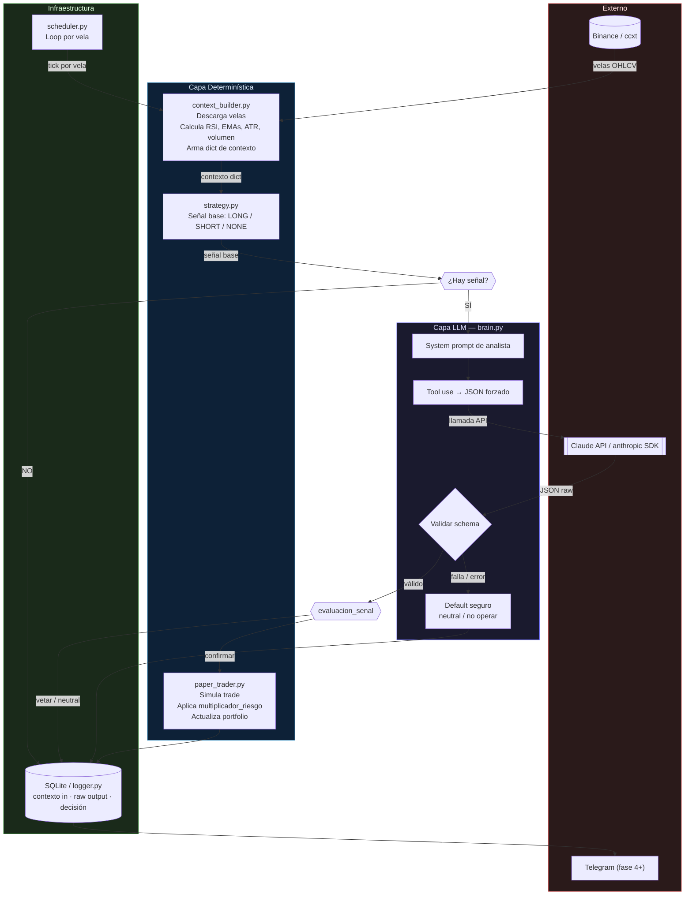

# Arquitectura — Trading Brain

> **Simplificación del diagrama:** el flujo `SIG → NO → LOG` omite el caso en que haya una posición abierta y la señal desaparezca (`senal_base = "NONE"`). En ese caso el paper trader evalúa el cierre por `SIGNAL_CLOSE` o `TIMEOUT` antes de ir al log. Esta lógica vive en `paper_trader.py` y está documentada en `paper_trader.md`.
